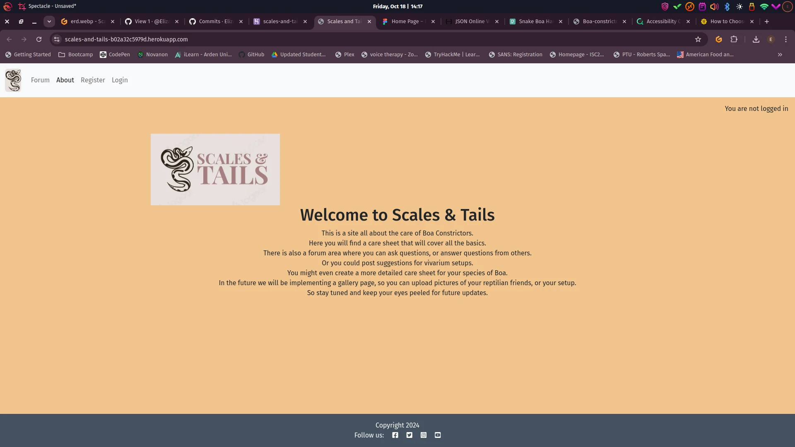
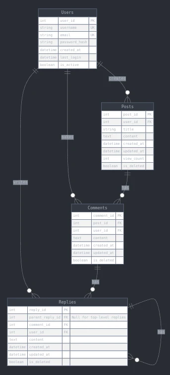

# Scales & Tails



## Introduction

Scales & Tails is a information resource with social forum interactivity. Scales & Tails is my Code Institute Full-Stack Developer Bootcamp personal project - focusing on Django and Bootstrap frameworks, Database manipulation and CRUD functionality. It is for educational purposes only.

View live site here : [Scales & Tails](https://scales-and-tails-b02a32c5979d.herokuapp.com/)  
  
For Admin access with relevant sign-in information: [Scales & Tails Admin](https://scales-and-tails-b02a32c5979d.herokuapp.com/admin/login/?next=/admin/)

<hr>


## Overview

Scales and Tails is a site for users to look up care information for their pet snakes:

- Users that sign up can post questions they have or answer other users questions
- Create their own profiles
- View basic care sheets for Boa constrictors 

Scales & Tails is a fully responsive site, and is viewable across all platforms (mobile, tablet and desktop). This is a site for snake enthusiasts from beginners to experts to look up care information for their pets.
The site will be broken down into species sections where there will be basic care information and a forum section for users to ask questions, post replies or just upload images.


# UX - User Experience

## Design Inspiration
My design inspiration was to keep the model simple for the first itiration of my project, so that users would find navigating the site easy.


### Colour Scheme

I chose these colours to keep in the theme of the colouring on many common Boa's.


### Site Goals
The Goal of this site is to provide a basic care sheet for common Boa Constrictors. Then provide an area where logged in users can ask questions, answer other peoples questions or post more detailed information.


## Agile Methodologies - Project Management
I followed the agile process while completing this project


### MoSCoW Prioritization

I chose to follow the MoSCoW Prioritization method for Scales & Tails, identifying and labelling my:

- **Must Haves**: the 'required', critical components of the project. Completing my 'Must Haves' helped me to reach the MVP (Minimum Viable Product) for this project early, allowing me to develop the project further than originally planned.
  
- **Should Haves**: the components that are valuable to the project but not absolutely 'vital' at the MVP stage. The 'Must Haves' must receive priority over the 'Should Haves'.
- **Could Haves**: these are the features that are a 'bonus' to the project, it would be nice to have them in this phase, but only if the most important issues have been completed first and time allows.
- **Won't Haves**: the features or components that either no longer fit the project's brief or are of very low priority for this release. 

### Sprints


| Sprint No. | Sprint Content | Start/Finish Dates |
|------------|----------------|--------------------|
| #1 | Project Setup |  |
| #2 | All Auth Setup/Site Navigation |  |
| #3 | Profile/Articles Features |  |
| #4 | Frontend Development |  |
| #6 | Testing/Documentation |  |


## User Stories

User stories and features recorded and managed on [GitHub Projects](<https://github.com/users/Elizabeth9-77/projects/10/views/1>)


### Visitor User Stories

| User Story | Priority |
|----------------------------------------------------------------------------------------------------------------------------|---------------|


### Epic - User Profile

| User Story | Priority |
|----------------------------------------------------------------------------------------------------------------------------|---------------|    


### Epic - Posts

| User Story | Priority |
|----------------------------------------------------------------------------------------------------------------------------|---------------|


  
### Epic - Comments

| User Story | Priority |
|----------------------------------------------------------------------------------------------------------------------------|---------------|


### Epic - Replies

| User Story | Priority |
|----------------------------------------------------------------------------------------------------------------------------|---------------|


Essential features of my project were:

- An appealing website keeping the theme and colouring of common Boa's
- Responsive website for users of mobile, tablet and desktop devices
- User Authentication
- User Profile creation and editing
- Posts feature with full CRUD functionality
- Comments feature with full CRUD functionality
- replies feature with full CRUD functionality

Planning my project thoroughly from the start allowed me to identify areas of importance for MVP completion and satisfaction of assessment criteria, and to balance them with the feasibility of the features.


## Skeleton & Surface Planes

### Wireframes

The wireframes for Scales & Tails were created in Figma. [Figma](www.figma.com) is an easy and fast design system for web and software mockups that allows for great control and testing of ideas particularly within the specific frame sizes which represent different devices. As I was using Bootstrap, I was confident that I had created a modular structure for my feature elements that would suit a grid system and that would allow them to easily work across different devices and screen sizes.

**Mobile/Tablet view for:**  

- Home
- Sign Up
- Forum


<details open>
    <summary>Mobile/Tablet Home Page Wireframe</summary>  
      
</details>
  
I decided to have the homepage set as the about page, so that user instantly knew what the site was about. I used a basic text area with an logo design created using Logoai.com


**Desktop view for:**

- Home
- Sign Up
- Log in
- About
- Forum


### Database Schema - Entity Relationship Diagram

  
*Database Schema (ERD) for Scales & Tails displaying relationships between feature components saved within the database*

This Entity Relationship Diagram(ERD) demonstrates how each feature interacts with each other and the connected PostgreSQL Database. Using Django's User Model, and Django AllAuth to carry out all user authentication, a user_id is created when the user registers with their username and email. This allows the user to edit a blank profile, create new articles, add comments and Reply to comments or other replies, which will display their username on any post, comment or reply they make.

The Profile, Articles and Comments Models were inspired by the blog walkthrough by the Code Institute and the [https://learn.codeinstitute.net/courses/course-v1:CodeInstitute+FSD101_WTS+4/courseware/713441aba05441dfb3a7cf04f3268b3f/824fccecd0fe4e44871eeabcbf69d830/] during my learning of Django. They helped me to get a good and secure grasp of the templating structure and connected Python files to push my features further, make them my own and then develop my nested replies model.


Through the Admin Django Dashboard, the connected user_id to all data entered to the site means that the Admin can remove a User and their data completely through the additon of on_delete=models.CASCADE. At the moment, a user can remove any data they share with the site, but they cannot delete their account completely. This feature will come in the next version.

### Security


**AllAuth**  

Django AllAuth is an installable framework that takes care of the user registration and authentication process. Authentication was needed to determine when a user was registered or unregistered and it controlled what content was accessible on Scales & Tails. The setup of AllAuth included:

- installing it to my workspace dependencies
- adding it to my INSTALLED_APPS in my settings.py
- sourcing the AUTHENTICATION_BACKENDS from the AllAuth docs for my settings.py
- adding its URL to my projects 'urls.py'
- run database migrations to create the tables needed for AllAuth
- 
**Defensive Design**  

Scales & Tails was developed to ensure a smooth user experience, to the best of my current learning experience with Django. 

- Input validation and error messages provide feedback to the user to guide them towards the desired outcome. 
- Unregistered users are diverted to the Sign Up page from restricted access pages. 
- Authentication processes control edit/delete icons to reveal them to the content author only. 
- Deletion of data is confirmed through an additional modal, double-checking with the user.
- Error pages are displayed with 'Take me home' buttons to help users get back on track. 
- Testing and validation of features completes the process.
- All posts and associated comments and replies have to be authorised by admin before they can be seen by the user.

**CSRF Tokens** 

CSRF (Cross-Site Request Forgery) tokens are included in every form to help authenticate the request with the server when the form is submitted. Absence of these tokens can leave a site vulnerable to attackers who may steal a users data.
  

# Features

## User View - Registered/Unregistered

It was important to me from the beginning that Scales & Tails be accessible to an unregistered user, in some capacitites. I wanted the website to sell the product to a new user quickly by immediately inviting them into the community through the park's information, articles and gallery sections. The following is a breakdown of the site's accessibility for registered/unregistered users:

| Feature   | Unregistered User | Registered, Logged-In User |
|-----------|-------------------|-----------------|
| Home Page | Visable           | Visable         |
| Profile   | Not Visible - 'Profile' icon only appears for registered, logged-in users | Visable and full feature interaction available |


## CRUD Functionality

Users are able to Create, Read, Update and Delete their shared information on Scales & Tails. Some features make full CRUD functionality available, whilst others present the necessary options only. Here is my CRUD breakdown for Scales & Tails:

| Feature | Create | Read | Update | Delete |
|---------|--------|------|--------|--------|
| Profile | Created upon registration | Yes | Yes | Full Profile deletion is currently only available to Admin upon User Account deletion, the profile dashboard clears automatically if a user removes all of their articles or bookings |


## Feature Showcase 
  

**Home Page**

<details open>
    <summary>Home Page - Visible to all Users</summary>  
      
</details>


**sign up Page**

<details open>
    <summary>Sign up Page - Visible to all Users</summary>  
      
</details>  

**Log in up Page**

<details open>
    <summary>Sign up Page - Visible to all Users</summary>  
      
</details>  

**Forum Page**

<details open>
    <summary>Forum Page Top - Visible to all Users</summary>  
      
</details>

<details open>
    <summary>Forum Page Bottom - Visible to all Users</summary>  
      
</details>

**Comments and replies page **
<details open>
    <summary>comments and replies page - Visible to logged in Users</summary>  
      
</details>

<hr>


**Profile**

  
The user profile is created upon registration and displays a placeholder image and 'Edit Profile' button to allow the user to personalise their view. With future releases this page will be accessible to other users and allow connection, currently it is only viewable to the user.
  
  
 
*Site pagination kicks in to display 6 articles per page. Arrows at the base of the article section allow users to move forward and back*  


Unregistered Users are free to read the articles and comments left on Scales & Tails but they cannot 'Comment/Reply' to them until they have signed up and logged in.

  
*Admin approval is required for articles to keep Scales & Tails on topic. Feedback is provided to the user by message that the article is awaiting approval*


**Edit Article**
  
If a user spots a typo, error or wants to add new information to their article, then they may edit the article and submit for immediate reposting. A certain amount of trust exists between Admin and the Scales & Tails community to hope that no inappropriate or off-topic content will be shared, which will result in an immediate deletion of the user's account by the Admin. These issues will be locked down in the future development of Scales & Tails to allow certain content/words to be flagged and removed by the Admin or not allow the form to be submitted in the first place. Community guidelines will also be developed.


**Delete Article**
 
*User is informed that their article has been deleted.


**403, 404, 500 Pages**

These templates were added to this project in order to give the user the functionality to return to the website by using the links in the navigation bar or the Back to Homepage button on the Error page.


- They are triggered when a user tries to access:
  - information that is not theirs - 403,
  - information that does not exist anymore - 404,
  - something has gone wrong with the server and cannot retrieve database - 500

**Admin Panel**

Through Django's built-in Administration Panel, the Admin has full access over the data submitted to the website by registered Users. To access the Admin panel the Admin user adds '/admin/' to the end of the URL to display the admin page. A username and password is requested. For Scales & Tails, Admin approval is needed for articles and comments to keep the site on topic and to prevent spamming. Registered, logged-in users' have instant access to make a booking and upload images.

 
*Django Admin panel view for Scales & Tails Administrator - content selection menu on left hand side*  


Users articles and comments require approval by the Admin of Scales & Tails to keep the website content on topic. Admin can change the status of articles from 'Draft' to 'Published'.
    

## Future Features
- A gallery page would be added, for users to upload their own photos of their pets or setups
- Futher pages would be added for differnt species of snakes, keeping the same format as the current page for Boa's
   
# Technologies & Languages Used

- HTML
- CSS
- JavaScript
- Python
- [Github](https://www.github.com) used for online storage of codebase and Projects tool.
- [Figma](https://www.figma.com) for project design planning and wireframe creation.
- [Adobe Color](https://color.adobe.com) for colour theme creation and accessibility checkers.
- [Django](https://www.djangoproject.com/) was used as the Python framework for the site.
- [PostgreSQL](https://dbs.ci-dbs.net/).com/) was used to host the PostgreSQL database needed to collect and recall the users data.
- [Heroku](https://www.heroku.com) was used to host the Scales & Tails application.

## Libraries & Frameworks

- Bootstrap v5.2.3
- Django v3.2.19
- Django AllAuth v0.54.0
- Django Crispy Forms v2.0
- Crispy Bootstrap5 v0.7
- Django summernote
- Django RichTextField v1.6.1
- Django Summernote v0.8.2
- Python Slugify v8.0.1
  

## Tools & Programs

- [Tiny Png](https://tinypng.com/) for file size reduction.
- [Github](https://www.github.com) for intial project agile planning.
- [Perplexity AI](https://www.perplexity.ai/) for breaking down Python concepts and Django documentation into more understandable chunks.
- [LogoAI](https://www.logoai.com/) for design inspiration using my font and colour choices.

## Testing


Validation was carried out using:
-W3C HTML Validator [W3C Validatator](https://validator.w3.org/detailed.html)
-W3 Jigsaw CSS validator [W3 Jigsaw](https://jigsaw.w3.org/css-validator/)
-Codebeautify JS validator [Codebeautify](https://codebeautify.org/jsvalidate)
-Code Institute python linter [CI python linter](https://pep8ci.herokuapp.com/)

<details open>
    <summary>Admin.py Validation</summary>  
      
</details>
<details open>
    <summary>Forms.py validation</summary>  
      
</details>
<details open>
    <summary>Manage.py validation</summary>  
      
</details>
<details open>
    <summary>Models.py validation</summary>  
      
</details>
<details open>
    <summary>urls.py validation</summary>  
      
</details>
<details open>
    <summary>base.html validation</summary>  
      
</details>
<details open>
    <summary>create_post.html validation</summary>  
      
</details>
<details open>
    <summary>edit_post.html validation</summary>  
      
</details>
<details open>
    <summary>index.html validation</summary>  
      
</details>
<details open>
    <summary>post_detail.html validation</summary>  
      
</details>
<details open>
    <summary>Comments.js validation</summary>  
      
</details>
<details open>
    <summary>CSS validation</summary>  
      
</details>


# Deployment
  
## Connecting to GitHub  

To begin this project from scratch, you must first create a new GitHub repository using the [Code Institute's Template](https://github.com/Code-Institute-Org/ci-full-template). This template provides the relevant tools to get you started. To use this template:

1. Log in to [GitHub](https://github.com/) or create a new account.
2. Navigate to the above CI Full Template.
3. Click '**Use this template**' -> '**Create a new repository**'.
4. Choose a new repository name and click '**Create repository from template**'.
5. In your new repository space, click the purple CodeAnywhere (if this is your IDE of choice) button to generate a new workspace.

## Django Project Setup

1. Install Django and supporting libraries: 
   
- ```pip3 install 'django<4' gunicorn```
- ```pip3 install dj_database_url psycopg2```
- ```pip3 install dj3-cloudinary-storage```  
  
2. Once you have installed any relevant dependencies or libraries, such as the ones listed above, it is important to create a **requirements.txt** file and add all installed libraries to it with the ```pip3 freeze --local > requirements.txt``` command in the terminal.  
3. Create a new Django project in the terminal ```django-admin startproject Scales & Tails .```
4. Create a new app eg. ```python3 mangage.py startapp ```
5. Add this to list of **INSTALLED_APPS** in **settings.py** - '',
6. Create a superuser for the project to allow Admin access and enter credentials: ```python3 manage.py createsuperuser```
7. Migrate the changes with commands: ```python3 manage.py migrate```
8. An **env.py** file must be created to store all protected data such as the **DATABASE_URL** and **SECRET_KEY**. These may be called upon in your project's **settings.py** file along with your Database configurations. The **env.py** file must be added to your **gitignore** file so that your important, protected information is not pushed to public viewing on GitHub. For adding to **env.py**:

- ```import os```
- ```os.environ["DATABASE_URL"]="<copiedURLfromElephantSQL>"```
- ```os.environ["SECRET_KEY"]="my_super^secret@key"```
  
For adding to **settings.py**:

- ```import os```
- ```import dj_database_url```
- ```if os.path.exists("env.py"):```
- ```import env```
- ```SECRET_KEY = os.environ.get('SECRET_KEY')``` (actual key hidden within env.py)  

9. Replace **DATABASES** with:

```
DATABASES = {
    'default': dj_database_url.parse(os.environ.get("DATABASE_URL"))
  }
```

10. Set up the templates directory in **settings.py**:
- Under ``BASE_DIR`` enter ``TEMPLATES_DIR = os.path.join(BASE_DIR, ‘templates’)``
- Update ``TEMPLATES = 'DIRS': [TEMPLATES_DIR]`` with:

```
os.path.join(BASE_DIR, 'templates'),
os.path.join(BASE_DIR, 'templates', 'allauth')
```

- Create the media, static and templates directories in top level of project file in IDE workspace.

11. A **Procfile** must be created within the project repo for Heroku deployment with the following placed within it: ```web: gunicorn *******.wsgi```
12. Make the necessary migrations again.


## Heroku deployment

To start the deployment process , please follow the below steps:

1. Log in to [Heroku](https://id.heroku.com/login) or create an account if you are a new user.
2. Once logged in, in the Heroku Dashboard, navigate to the '**New**' button in the top, right corner, and select '**Create New App**'.
3. Enter an app name and choose your region. Click '**Create App**'. 
4. In the Deploy tab, click on the '**Settings**', reach the '**Config Vars**' section and click on '**Reveal Config Vars**'. Here you will enter KEY:VALUE pairs for the app to run successfully. The KEY:VALUE pairs that you will need are your: 
   
   - **DATABASE_URL**:**postgres://...** 
   - **DISABLE_COLLECTSTATIC** of value '1' (N.B Remove this Config Var before deployment),
   -  **PORT**:**8000**
   -  **SECRET_KEY** and value  
  
5. Add the Heroku host name into **ALLOWED_HOSTS** in your projects **settings.py file** -> ```['herokuappname', ‘localhost’, ‘8000 port url’].```
6. Once you are sure that you have set up the required files including your requirements.txt and Procfile, you have ensured that **DEBUG=False**, save your project, add the files, commit for initial deployment and push the data to GitHub.
7. Go to the '**Deploy**' tab and choose GitHub as the Deployment method.
8. Search for the repository name, select the branch that you would like to build from, and connect it via the '**Connect**' button.
9.  Choose from '**Automatic**' or '**Manual**' deployment options, I chose the 'Manual' deployment method. Click '**Deploy Branch**'.
10. Once the waiting period for the app to build has finished, click the '**View**' link to bring you to your newly deployed site. If you receive any errors, Heroku will display a reason in the app build log for you to investigate. **DISABLE_COLLECTSTATIC**  may be removed from the Config Vars once you have saved and pushed an image within your project, as can **PORT:8000**.

## Clone project

A local clone of this repository can be made on GitHub. Please follow the below steps:

1. Navigate to GitHub and log in.
2. The [Scales & Tails Repository](https://github.com/Elizabeth9-77/Scales-Tails-V) can be found at this location.
3. Above the repository file section, locate the '**Code**' button.
4. Click on this button and choose your clone method from HTTPS, SSH or GitHub CLI, copy the URL to your clipboard by clicking the '**Copy**' button.
5. Open your Git Bash Terminal.
6. Change the current working directory to the location you want the cloned directory to be made.
7. Type `git clone` and paste in the copied URL from step 4.
8. Press '**Enter**' for the local clone to be created.
9. Using the ``pip3 install -r requirements.txt`` command, the dependencies and libraries needed for Scales & Tails will be installed.
10. Set up your **env.py** file and from the above steps for Cloudinary and ElephantSQL, gather the Cloudinary API key and the Elephant SQL url for additon to your code.
11. Ensure that your **env.py** file is placed in your **.gitignore** file and follow the remaining steps in the above Django Project Setup section before pushing your code to GitHub.

## Fork Project

A copy of the original repository can be made through GitHub. Please follow the below steps to fork this repository:  

1. Navigate to GitHub and log in.  
2. Once logged in, navigate to this repository using this link [Scales & Tails Repository](https://github.com/Elizabeth9-77/Scales-Tails-V).
3. Above the repository file section and to the top, right of the page is the '**Fork**' button, click on this to make a fork of this repository.
4. You should now have access to a forked copy of this repository in your Github account.
5. Follow the above Django Project Steps if you wish to work on the project.

# Credits

## Code

The following blogs/tutorials complemented my learning for this project, alongside the [Code Institute's](https://codeinstitute.net/ie/) Learning Content.

- [Django Docs](https://www.djangoproject.com/)
- [Bootstrap Docs](https://getbootstrap.com/docs/5.3/getting-started/introduction/)
- [Code Institute's](https://github.com/Code-Institute-Org>) Blog/Boutique Ado walkthroughs
- [Django save method](https://docs.djangoproject.com/en/4.2/ref/models/instances/) in models.py  
- [Django UserCreationForm](https://www.javatpoint.com/django-usercreationform>) Creating New Users 
- [Django Docs](https://docs.djangoproject.com/en/dev/ref/contrib/admin/#django.contrib.admin.ModelAdmin.readonly_fields) to make model item readonly for search function showing deleted articles

## Media

The following sites were used to gather the photographic media used in Scales & Tails:
- [Logoai](https://www.logoai.com/)
- [Pexels](https://www.pexels.com/)
- [Unsplash](https://unsplash.com/)
 <details>
   <summary>Credit to the following photographers</summary>
   
   -Photo by Ivan Rojas: https://www.pexels.com/photo/boa-serpiente-28290883/

 </details>

 


  
 
  
